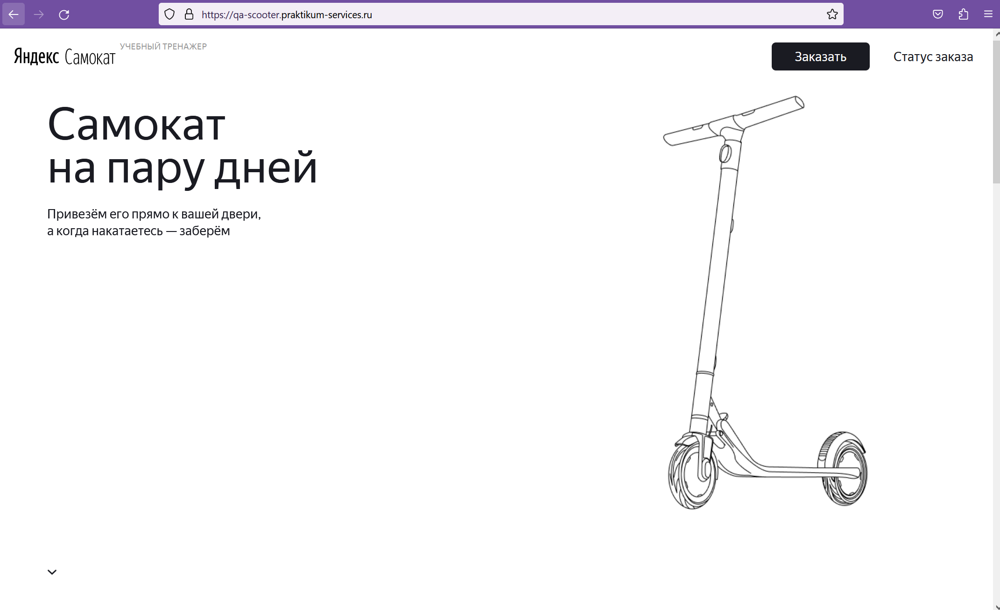
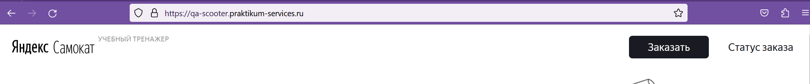
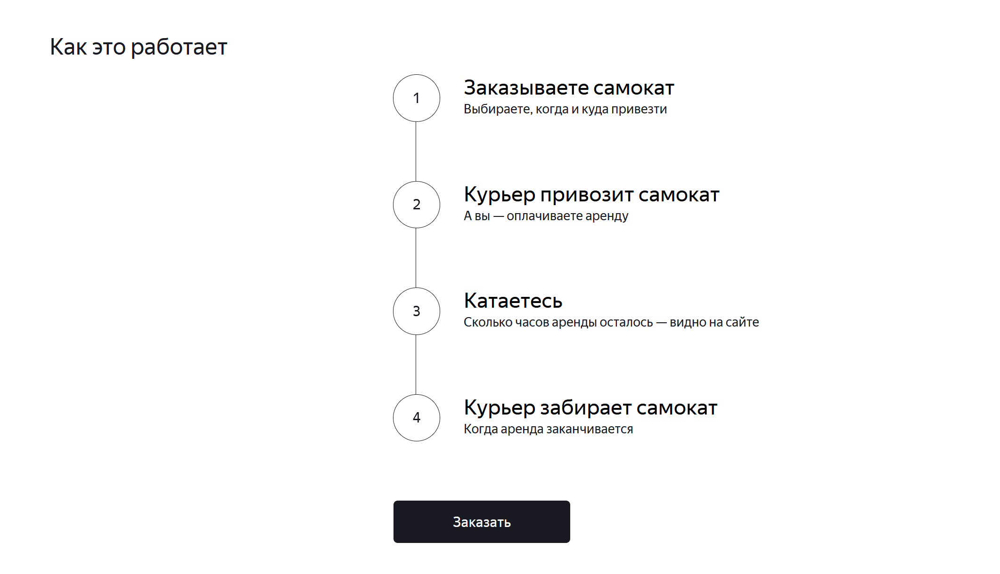
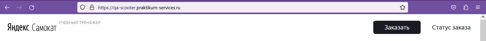
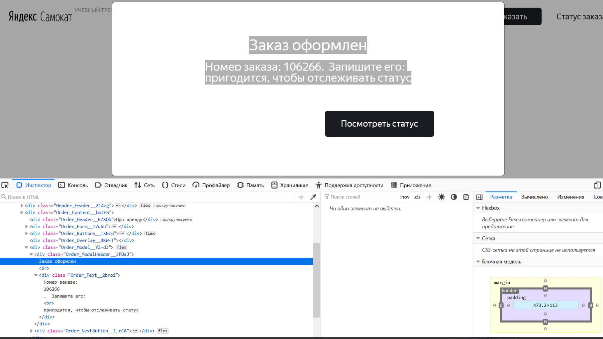

Проект создан для тестирования сервиса Яндекс(Учебный тренажер) по заказу самокатов 
Тестирование проводится через браузер Mozilla FireFox
ссылка на тестируемый сайт https://qa-scooter.praktikum-services.ru/
Главная страница:

В main_page (в зависимости от приставки locators/test/page) 
находятся локаторы, тесты и методы для тестирования раздела "Вопросы о важном" на главной странице

В orders_page (в зависимости от приставки locators/test/page) 
находятся локаторы, тесты и методы для тестирования заказа самоката разными способами,

также переходы по логотипам в хедере "Яндекс" и "Самокат"

В директории locators есть файл test_data,
где хранятся тестовые данные для тестов входящих в  orders_page

Проблема реализации проекта:
При оформлении заказа, номер заказа динамически подставляется в текст с задержкой, 
не являясь отдельным элементом(номер вставляется в текст частью текста), 
через Order_ModalHeader достается весь класс, отдельно заголовок вытащить нельзя,
поэтому в тесте используется регулярное выржаение,
которое достает часть текста (соответствующую заголовку) из модального окна.

